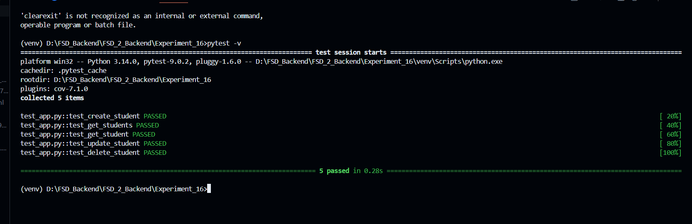
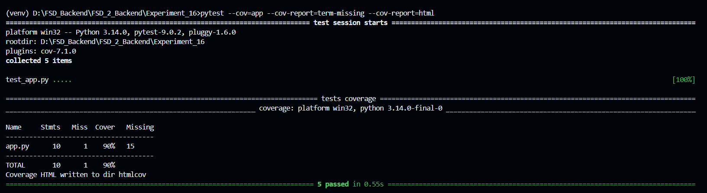
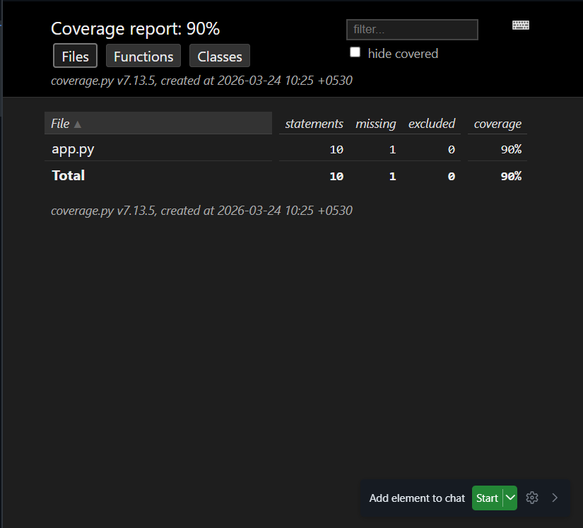
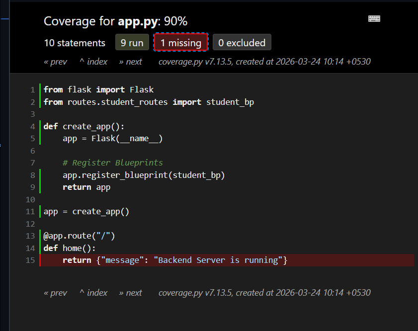

# Flask Backend Architecture: RESTful API Implementation (Experiment 16)

### Application Directory Layout

```bash
Experiment_16_Backend/
├── routes/
│   └── student_routes.py
├── venv/
│   ├── Include/
│   ├── Lib/
│   └── Scripts/
├── requirements.txt
├── app.py
├── run.py
└── README.md
```

### Stack & Tools Incorporated

- Python Programming Language
- Flask Micro-framework
- RESTful Architectural Style
- Postman (API Verification)
- Cloud Hosting via Render
- Python `venv` (Environment Isolation)

### Live Application Link --> [View on Render](https://two3bis70035-experiment-8.onrender.com)

---

## Visual Walkthrough & Execution Phases

### Step 1: Initializing the Server

The Flask local development server has been spun up successfully.

### Step 2: Student Creation (POST Request)


### Step 3: Fetching the Student Roster (GET Request)


### Step 4: Fetching a Specific Student
#### Testing GET Request with Invalid ID (ID = 2)


### Step 5: Updating Student Records (PUT Request)


### Step 6: Removing a Student (DELETE Request)


---

## Defined API Routing

| HTTP Method | Route URL | Action Performed |
|-------------|-----------|------------------|
| POST        | `/students` | Register a new student |
| GET         | `/students` | Retrieve the entire list of students |
| GET         | `/students/<id>` | Retrieve details of a specific student by their identifier |
| PUT         | `/students/<id>` | Modify existing student data |
| DELETE      | `/students/<id>` | Erase a student record |

## Key Takeaways & Practical Skills Acquired
- Gained fundamental understanding of server-side programming and backend frameworks.
- Mastered the configuration of an isolated Python workspace utilizing `venv`.
- Developed practical experience building applications with the Flask framework.
- Attained proficiency in designing and structuring RESTful API patterns.
- Successfully implemented URL routing and endpoint handling mechanisms inside Flask.